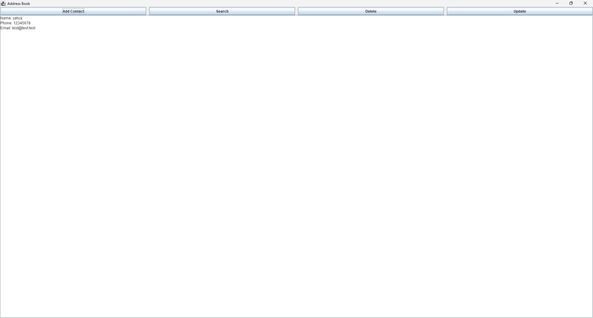

**Address Book Java Application**

A Java address book application demonstrating strong object-oriented programming (OOP) skills. The project includes separate classes for contacts and the address book.

**Features**
Add Contacts: Easily add new contacts to the address book.
Search Contacts: Search for contacts by name.
Update Contacts: Update existing contact details.
Delete Contacts: Remove contacts from the address book.

